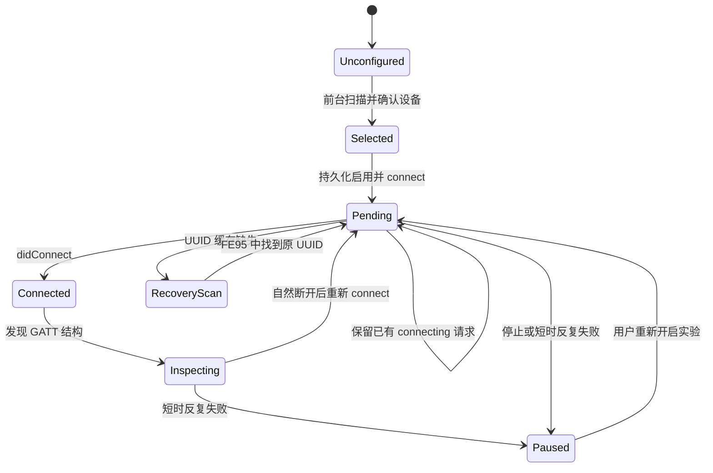

# 早期源码审查与架构判断

这是公开上游项目的历史源码对照。文中的阶段规划记录了设计来源，当前 App 的功能和验收边界以 [README](../README.md)、[在线协议说明](ONLINE_PROTOCOL_ROOT_CAUSE.md)和[验证记录](VALIDATION.md)为准。

核对日期：2026-09-25。审查基于下列提交的实际源码，不把 README 或作者描述当成本项目真机证明。

| 仓库 | 固定提交 |
| --- | --- |
| `jdelaire/scale` | `7c1e6c31a4260a0afd10ba7eb1a6096dea5303c6` |
| `nokistin/xiaomi-s400-live` | `4f39dc48a7d22e1c9c15a4ecd0db684aa1ea9282` |

## 平台判断：适合作为首选 PoC，尚不能保证目标体验

[Apple Core Bluetooth 后台指南](https://developer.apple.com/library/archive/documentation/NetworkingInternetWeb/Conceptual/CoreBluetooth_concepts/CoreBluetoothBackgroundProcessingForIOSApps/PerformingTasksWhileYourAppIsInTheBackground.html)明确支持持久连接请求及状态保存/恢复。pending connect 没有普通应用层超时；系统可替应用监控请求，并在连接完成时交付回调。后台扫描会合并重复发现、忽略 allowDuplicates，扫描间隔也可能增大，因此不能假设能集齐 S400 的多帧广播。

推论：先建立已知设备的 pending connect，比把后台重复广播当作可靠测量通道更值得优先测试。但 S400 的 connectable advertisement、唤醒窗口、标识稳定性以及连接占用仍是设备条件，不由 iOS 文档保证。每次后台唤醒应快速处理事件，不能用死循环、长期任务或计时器保活。登录/测量要依靠后续 BLE 回调推进，不能假设拥有无限或固定长度的执行窗口。

[Apple TN3115](https://developer.apple.com/documentation/technotes/tn3115-bluetooth-state-restoration-app-relaunch-rules)区分 suspended 激活和进程 relaunch。系统移除内存可以触发恢复；恢复需要尚在等待的 BLE 操作和对应事件。系统设置中切换蓝牙可能取消恢复资格，设备重启后可能要先解锁。最新说明对 Force Quit、控制中心蓝牙等部分场景增加 iOS 26 AccessorySetupKit 条件，不能笼统说所有 App 都一样。本 PoC 没有使用 ASK，仍要求不手动划掉 App，特殊操作后手动打开确认。

## `jdelaire/scale`：广播测量可参考，后台层必须替换

| 代码证据 | 确认结果与处理 |
| --- | --- |
| [S400ScannerService.swift L19–22, L54–61](https://github.com/jdelaire/scale/blob/7c1e6c31a4260a0afd10ba7eb1a6096dea5303c6/S400Scale/BLE/S400ScannerService.swift#L19) | 无恢复标识的 central；nil service scan + duplicates；没有 connect/GATT 登录。重写 transport 生命周期。 |
| [Info.plist](https://github.com/jdelaire/scale/blob/7c1e6c31a4260a0afd10ba7eb1a6096dea5303c6/S400Scale/Resources/Info.plist)、[project.yml](https://github.com/jdelaire/scale/blob/7c1e6c31a4260a0afd10ba7eb1a6096dea5303c6/project.yml) | 有蓝牙/HealthKit 描述，但没有 bluetooth-central；构建还依赖生成秘密文件。新 PoC 无密钥构建步骤。 |
| [Aggregator L42–92](https://github.com/jdelaire/scale/blob/7c1e6c31a4260a0afd10ba7eb1a6096dea5303c6/S400Scale/BLE/S400MeasurementAggregator.swift#L42) | weight、impedance、low-frequency impedance 齐备才结束；10 秒近似去重仅在内存。session 按设备聚合，lastSeenAt 没有用于淘汰，不能直接保证隔离多人/跨次测量。GATT final 应直接产生记录，不走此聚合器。 |
| [MeasurementStore L19–34](https://github.com/jdelaire/scale/blob/7c1e6c31a4260a0afd10ba7eb1a6096dea5303c6/S400Scale/MeasurementStore/MeasurementStore.swift#L19)、[持久容器](https://github.com/jdelaire/scale/blob/7c1e6c31a4260a0afd10ba7eb1a6096dea5303c6/S400Scale/MeasurementStore/MeasurementPersistenceController.swift) | 可参考 Core Data 映射，但需加唯一键、事务 outbox、错误恢复和明确文件保护；不能照搬启动 fatalError。 |
| [BodyCompositionCalculator](https://github.com/jdelaire/scale/blob/7c1e6c31a4260a0afd10ba7eb1a6096dea5303c6/S400Scale/BodyCompositionCalculator/BodyCompositionCalculator.swift) | 数值纯逻辑较易接入，但只是模型估算，需输入校验和用户告知。先只做体重。 |
| [AppModel L117–184](https://github.com/jdelaire/scale/blob/7c1e6c31a4260a0afd10ba7eb1a6096dea5303c6/S400Scale/App/AppModel.swift#L117) | 保存后自动导出，但 profileId 主要记录/传递，没有严格的归属过滤。导出前必须新增 owner gate。 |
| [HealthKitExporter L200–283, L389–425](https://github.com/jdelaire/scale/blob/7c1e6c31a4260a0afd10ba7eb1a6096dea5303c6/S400Scale/HealthKitExporter/HealthKitExporter.swift#L200) | 单位、sample 创建和授权结构可参考；external UUID 查询去重吞掉 query error，把 nil 视为无数据。锁屏背景不能原样复用。 |

另外，该提交根目录未见 LICENSE。Phase 1 为独立实现，没有复制其实现源码；未来实际复用/分发代码前需解决授权。协议事实、模块组织与设计判断可作为参考。

## `xiaomi-s400-live`：已具备 GATT 实现，但不是 iOS 后台证明

| 代码证据 | 确认结果与处理 |
| --- | --- |
| [protocol.py](https://github.com/nokistin/xiaomi-s400-live/blob/4f39dc48a7d22e1c9c15a4ecd0db684aa1ea9282/xiaomi_s400_live/protocol.py) | 明确定义 0x0010 / 0x0019 认证与 0x001B 等加密通道；按实际 discovered service 映射，不能把 characteristic UUID 当 handle。 |
| [auth.py L100–153](https://github.com/nokistin/xiaomi-s400-live/blob/4f39dc48a7d22e1c9c15a4ecd0db684aa1ea9282/xiaomi_s400_live/auth.py#L100) | 12-byte token、16-byte 随机数交换、HMAC 双向校验。0x21 000000 是**设备返回**的成功确认，不是客户端最终写命令。 |
| [crypto.py](https://github.com/nokistin/xiaomi-s400-live/blob/4f39dc48a7d22e1c9c15a4ecd0db684aa1ea9282/xiaomi_s400_live/crypto.py) | HKDF 输出 64 bytes，前 40 bytes 分为两 key/IV；CCM tag 4 bytes、nonce 12 bytes、无 AAD。与广播 CCM 参数不同。 |
| [scale.py L60–95](https://github.com/nokistin/xiaomi-s400-live/blob/4f39dc48a7d22e1c9c15a4ecd0db684aa1ea9282/xiaomi_s400_live/scale.py#L60) | 找 0xA0 后解析 ASCII CSV。2 字段为 live；代码用 >=8 字段判断 final，弱于注释中的 32 字段定义。需要真实 payload 样本和严格校验，stable 不能代替 final。 |
| [scale.py L145–185, L187–251](https://github.com/nokistin/xiaomi-s400-live/blob/4f39dc48a7d22e1c9c15a4ecd0db684aa1ea9282/xiaomi_s400_live/scale.py#L145) | 主动扫描连接、订阅、登录及收帧。名称后缀匹配不适合长期身份校验；订阅失败被忽略；收帧需增强序号/长度校验；token 刷新只重试一次。 |
| [scale.py L244–278](https://github.com/nokistin/xiaomi-s400-live/blob/4f39dc48a7d22e1c9c15a4ecd0db684aa1ea9282/xiaomi_s400_live/scale.py#L244) | asyncio 会话模型，没有等价于 iOS restore/pending/reconnect 的后台架构。协议可以移植，Python 执行模型不能照搬。 |

该仓库为 Apache-2.0；实际移植时保留许可与来源说明。源码可证实算法和通信步骤存在，不能独立证明所有固件/手机的稳定性。

## 最小实施顺序

1. **Phase 1（当前）**：独立连接 PoC，先前台基线，再锁屏 15 分钟、1 小时、过夜；后台和系统终止恢复分别验收。
2. **Phase 2**：Phase 1 有真机证据后，先在前台移植认证/加密通道；用已记录 GATT UUID 和公开测试向量校验，再锁屏测登录延迟。
3. **Phase 3**：接收严格 final、校验用户归属、建立事务记录与 outbox。live 不入健康库。
4. **Phase 4**：先 bodyMass，依靠稳定 sync identifier/version 和本地持久队列重试；可选估算指标后加。
5. **Phase 5**：带认证的连接循环、断线恢复、多天连续实测、撤销权限/蓝牙关闭/密钥轮换的恢复路径。

## Phase 1 的状态关系

恢复不是新的“扫描一次”：先接收系统交还的 CBPeripheral、立即接回 delegate，待 poweredOn 后按 connected / connecting / disconnected / disconnecting 分别继续。保存用户停止意图，迟到回调不能重启连接。不用 timer、BGTaskScheduler 或 Mac 中继模拟系统后台能力。

## 锁屏 HealthKit 的关键设计修正

[Apple 说明](https://developer.apple.com/documentation/healthkit/protecting-user-privacy)：锁屏时健康数据库读操作可能不可用，但可以写入，系统会暂存，解锁后合并。因此需要“本地持久化后写入”，不依赖读取 HealthKit 来决定是否写入。

用设备标识、已确认 owner profile、可信设备时间/测量 ID、原始数据等构造稳定事件标识；每一种 quantity 再加字段后缀。设置 [HKMetadataKeySyncIdentifier](https://developer.apple.com/documentation/healthkit/hkmetadatakeysyncidentifier) 和 [HKMetadataKeySyncVersion](https://developer.apple.com/documentation/healthkit/hkmetadatakeysyncversion)。相同测量重传和 App 在 save 回调前被终止后重试，都必须复用标识。完成 save 再标记本地 outbox 成功，不能只用随机 UUID、内存集合或“同体重 10 秒”去重。
